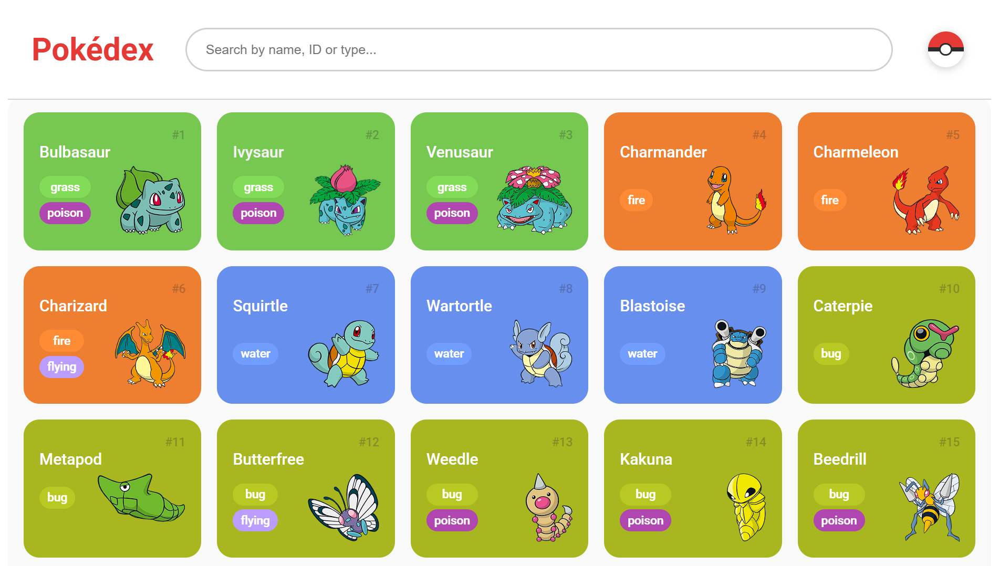
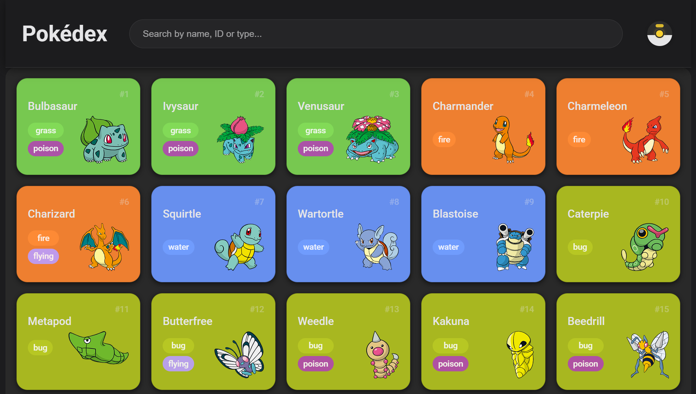
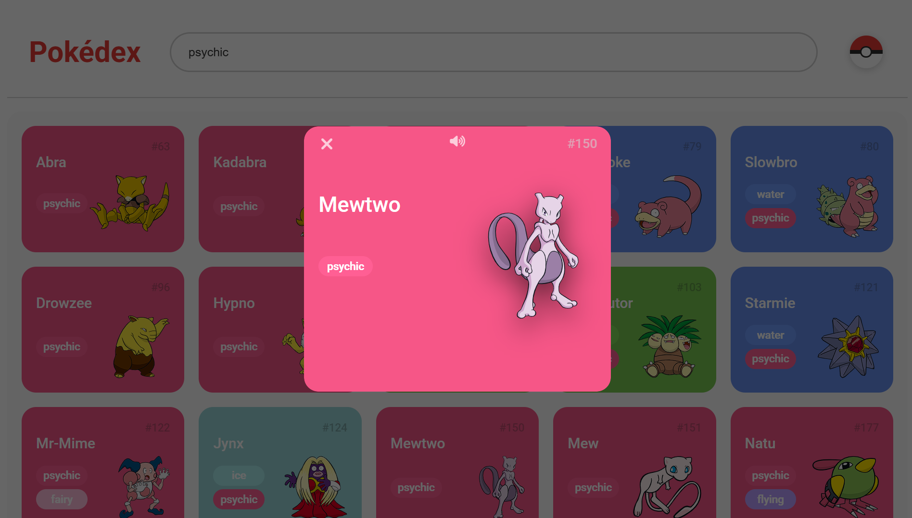
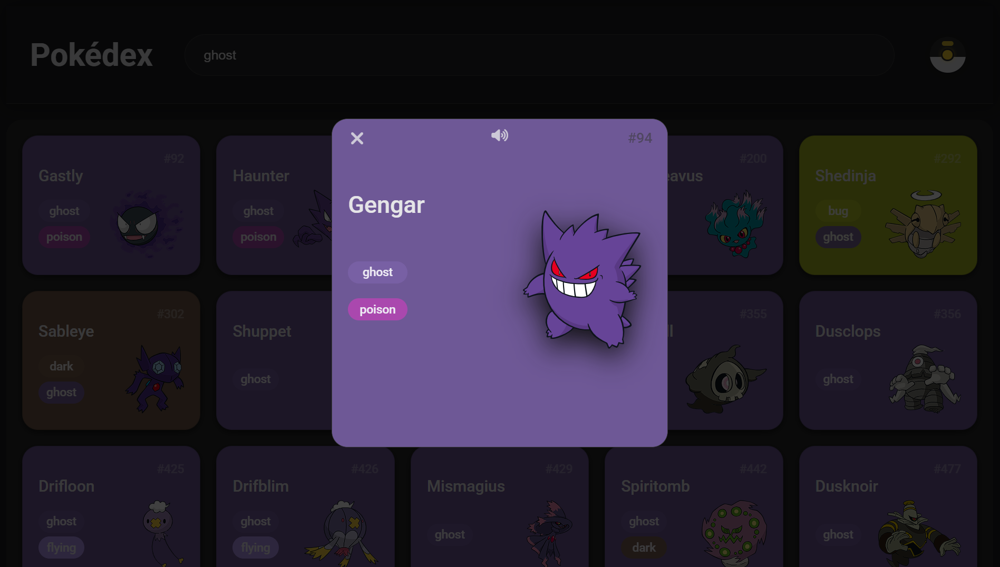

[Disponível também em Português](./README.pt-br.md)

# Pokédex

A responsive, accessible Pokédex web application built with vanilla HTML, CSS, and JavaScript. This project has undergone continuous evolution, from a simple script-based prototype to a modular, production-ready SPA with dark mode, search, modal details, and audio playback.

---

## Project Description

This project consumes the [PokéAPI](https://pokeapi.co/) to display Pokémon cards with type-based color coding, pagination, and detailed modal views. It was developed iteratively, with each phase introducing meaningful improvements in architecture, code quality, accessibility, and user experience.

The project serves as a practical demonstration of how a frontend application evolves from beginner-level code toward production standards, without any frameworks or build tools.

---

## Screenshots

<table>
  <tr>
    <td></td>
    <td></td>
  </tr>
  <tr>
    <td align="center"><b>Light Mode</b></td>
    <td align="center"><b>Dark Mode</b></td>
  </tr>
</table>

<table>
  <tr>
    <td></td>
    <td></td>
  </tr>
  <tr>
    <td align="center"><b>Light Mode</b></td>
    <td align="center"><b>Dark Mode</b></td>
  </tr>
</table>

---

## Features

### Core Features
- Displays Pokémon cards with name, number, type badges, and sprite
- Type-based card background colors (18 types)
- Paginated loading with a **Load More** button

### Features Added Through Evolution
- **Search** — filter by name, Pokémon ID, or type in real time
- **Search highlight** — matched terms are highlighted with `<mark>` in the results
- **Type badge click** — clicking a type badge triggers a type search automatically
- **Detail modal** — native `<dialog>` element showing Pokémon details on card click
- **Audio playback** — plays the Pokémon cry on modal open; click card to replay
- **Sound toggle** — enable/disable audio within the modal
- **Dark mode** — full theme system with `localStorage` persistence and `prefers-color-scheme` fallback
- **Animated Pokéball toggle** — rotates on hover; transforms into an Ultra Ball in dark mode
- **Responsive grid** — adapts from 1 to 8 columns across breakpoints
- **Accessibility** — skip link, `aria-*` attributes, `focus-visible` styles, keyboard navigation
- **Extended Pokédex** — expanded from the original 151 to all 1025 Pokémon

---

## Technologies Used

| Technology | Purpose |
|---|---|
| HTML5 | Semantic structure, `<dialog>`, `<header>`, `<main>`, `<footer>` |
| CSS3 | Custom properties, Grid, responsive layout, transitions |
| Vanilla JavaScript (ES6+) | Class fields, `Promise.allSettled`, `async/await`, modules |
| [PokéAPI](https://pokeapi.co/) | Pokémon data (names, types, sprites) |
| [PokeAPI Cries](https://github.com/PokeAPI/cries) | Pokémon audio cries (.ogg) |
| Normalize.css | Cross-browser CSS reset |
| Google Fonts — Roboto | Typography |
| Font Awesome 6 | Modal icons (close, sound) |

---

## Project Structure

```
/
├── index.html
└── assets/
    ├── screenshots/
    │   ├── Light_ModePK.png
    │   ├── Dark_ModePK.png
    │   ├── Modal_Light-PK.png
    │   └── Modal_Dark-PK.png
    ├── css/
    │   ├── colors.css       # CSS custom properties: type colors and UI tokens
    │   ├── global.css       # Body, header, footer, layout
    │   ├── pokedex.css      # Pokémon grid and card styles
    │   ├── modal.css        # Dialog and modal card styles
    │   ├── search.css       # Search input and highlight styles
    │   └── dark-mode.css    # Dark theme overrides and Pokéball component
    └── js/
        ├── pokemonModel.js  # Pokémon class definition
        ├── pokeApi.js       # API fetch and data mapping
        ├── main.js          # List rendering, pagination, state reset
        ├── modal.js         # Modal open/close, audio playback
        ├── search.js        # Search filtering, data preloading
        └── darkMode.js      # Theme toggle and persistence

        
```

---

## Installation

No build step or package manager required.

```bash
git clone https://github.com/your-username/pokedex.git
cd pokedex
```

Open `index.html` directly in a browser, or serve it locally:

```bash
# Using Python
python -m http.server 8080

# Using Node.js (npx)
npx serve .
```

Then visit `http://localhost:8080`.

> **Note:** The app fetches data from PokéAPI. An internet connection is required.

---

## Usage

| Action | Result |
|---|---|
| Scroll / click **Load More** | Loads the next batch of Pokémon |
| Type in the search bar | Filters by name, number, or type in real time |
| Click a type badge | Triggers a type search for the selected type |
| Click a Pokémon card | Opens the detail modal and plays the Pokémon cry |
| click anywhere on the card inside the modal | Replays the cry |
| Click the sound icon | Toggles audio on/off |
| Click the Pokéball (top right) | Toggles light/dark theme |
| Click the **Pokédex** title | Resets to the home state |
| Press `Escape` (modal closed) | Resets to the home state |

---

## Code Evolution

This project evolved across two distinct phases.

### Phase 1 — Prototype

- Single `index.html` with inline `<script>` references and no `defer`
- Three JS files with no clear separation of concerns
- `innerHTML +=` for list rendering (triggers full DOM re-parse on each append)
- `Promise.all` for parallel fetches (one failure aborted the entire batch)
- Type colors as plain CSS class rules with hardcoded hex values
- A single CSS file with all rules mixed together
- No error handling on fetch responses
- Limited to the original 151 Pokémon
- No accessibility considerations

### Phase 2 — Refactored SPA

- Six JS modules, each with a single responsibility
- Six CSS files, each scoped to a domain
- `insertAdjacentHTML('beforeend', ...)` replaces `innerHTML +=`
- `Promise.allSettled` with fulfilled-only filtering — resilient to partial API failures
- CSS custom properties replace all hardcoded color values
- `defer` on all scripts; correct load order guaranteed
- HTTP error handling via a centralized `parseResponse` function
- `MAX_RECORDS` extended to 1025
- Full accessibility pass: skip link, `aria-busy`, `aria-live`, `role="button"`, `tabindex`, `focus-visible`

---

## Refactoring Highlights

### Naming Conventions
| Before | After | Reason |
|---|---|---|
| `type` | `primaryType` | Avoids collision with DOM reserved word; more descriptive |
| `pokemon.photo` | `pokemon.sprite` | Accurate to PokéAPI terminology |
| `pokemonList` | `pokemon-list` (HTML id) | Consistent kebab-case for HTML ids |
| `loadMoreButton` | `load-more-button` (HTML id) | Same convention applied throughout |
| `getPokemons` | `fetchPokemon` | Pokémon is invariant in plural; `fetch` prefix signals an async network call |

### Syntax & Semantics
- `class Pokemon { type; types = []; photo; }` → `class Pokemon { primaryType = null; types = []; sprite = null; }` — explicit `null` defaults document intent
- `<ol>` changed to `<ul>` — the list is unordered; `<ol>` implied a meaningful sequence
- `<section>` changed to `<main>` — correct landmark role for primary content
- Type colors moved from `.fire { background-color: #ee7f30 }` to `--type-fire: #ee7f30` with `.fire { background-color: var(--type-fire) }` — single source of truth, enables theming

### Modularization
Each JS file now owns exactly one concern:
- `pokemonModel.js` — data shape only
- `pokeApi.js` — network and mapping only
- `main.js` — list rendering and pagination only
- `modal.js` — dialog lifecycle and audio only
- `search.js` — filtering logic and UI feedback only
- `darkMode.js` — theme state and persistence only

### Resilience
`Promise.all` was replaced with `Promise.allSettled`:
```js
// Before — one failed fetch rejects the entire batch
.then(requests => Promise.all(requests))

// After — failed fetches are silently skipped
.then(requests => Promise.allSettled(requests))
.then(results => results
    .filter(r => r.status === 'fulfilled')
    .map(r => r.value)
)
```

---

## Challenges and Improvements

- **`dream_world` sprites** — some Pokémon (especially Gen 5+) return `null` for the dream world SVG. The current implementation uses nullish coalescing (`??`) to fall back to `front_default`, preventing broken image elements.
- **Search preloading** — fetching all 1025 Pokémon on search focus introduces a ~1–2s delay on first use. A loading state in the input placeholder reduces perceived latency.
- **Inter-module communication** — without a module bundler, `window.convertPokemonToListItem` and `window.resetToHomeState` are exposed as globals. This is a deliberate trade-off that avoids `import/export` syntax without requiring a build step.
- **Audio autoplay policy** — browsers block audio without user interaction. `NotAllowedError` and `AbortError` are caught and suppressed; all other audio errors are logged to the console.

---

## Future Improvements

### Modal — About
- [ ] Pokémon species, legendary and mythical status
- [ ] Abilities, color, form, and held items

### Modal — Details
- [ ] Weight, height, and base EXP
- [ ] Stats with progress bars styled to match the modal header color

### Modal — Moves
- [ ] Move list with learning methods

### Modal — Locations
- [ ] Habitat, Pal Park areas, encounter conditions, encounter methods, and location areas

### Modal — Games
- [ ] Generation, growth rate, evolution triggers, versions, and Pokédex entries

### Modal — Evolutions
- [ ] Full evolution chain with only the current Pokémon highlighted as active

### General
- [ ] Favorites list persisted in `localStorage`
- [ ] Filter panel by generation, type, or stat range
- [ ] Infinite scroll as an alternative to Load More
- [ ] Replace `window.*` globals with native ES modules (`type="module"`)
- [ ] Service Worker for offline support and asset caching
- [ ] Unit tests for `pokeApi.js` and search filtering logic
- [ ] CI/CD pipeline with GitHub Actions for linting and deployment

---

## License

This project is licensed under the [MIT License](./LICENSE).

Pokémon data and assets are provided by [PokéAPI](https://pokeapi.co/) and are the property of Nintendo / Game Freak. This project is not affiliated with or endorsed by Nintendo.

---

## Credits

This project was developed with the support of the [DIO (Digital Innovation One)](https://github.com/digitalinnovationone) platform, under the guidance of developer [Renan Johannsen de Paula.](https://github.com/RenanJPaula)